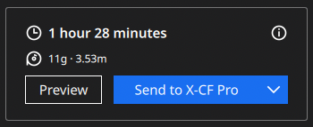
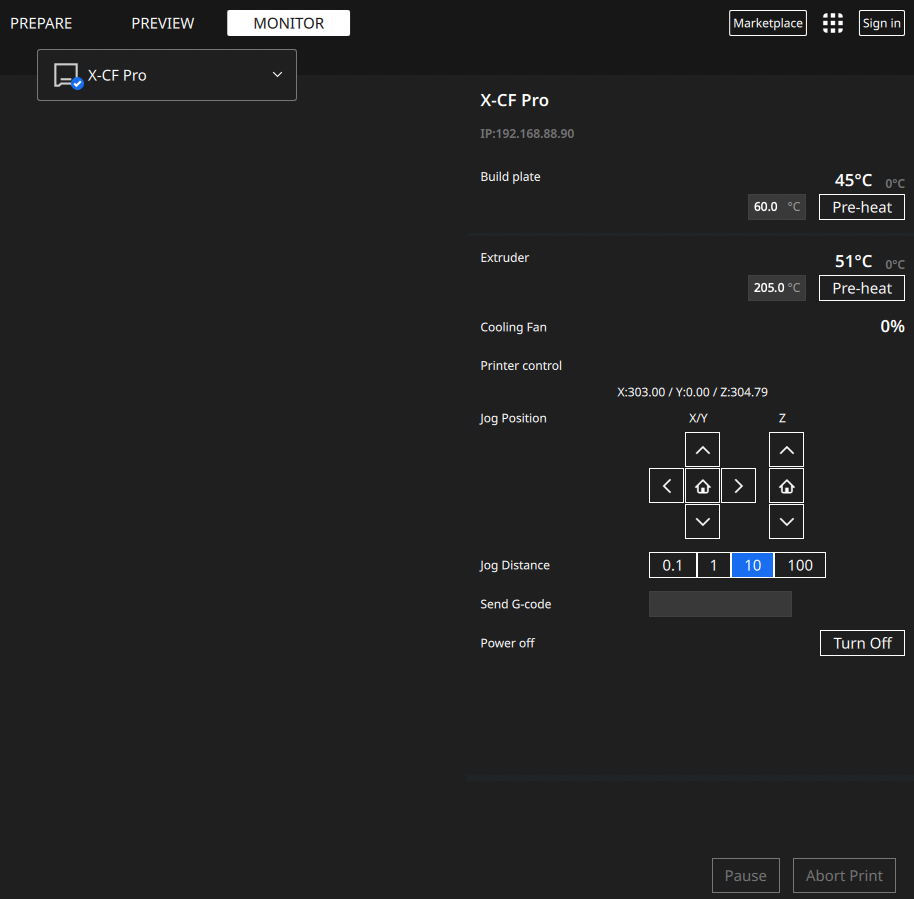
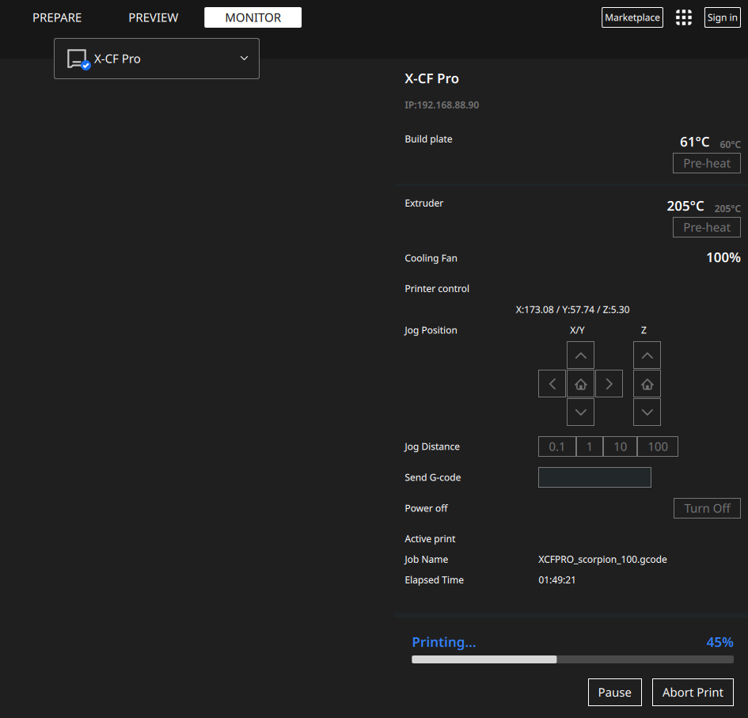
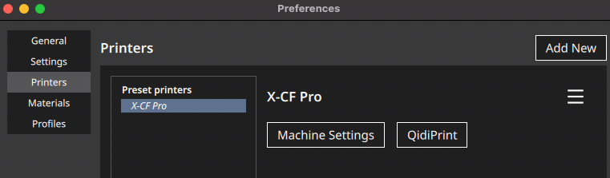
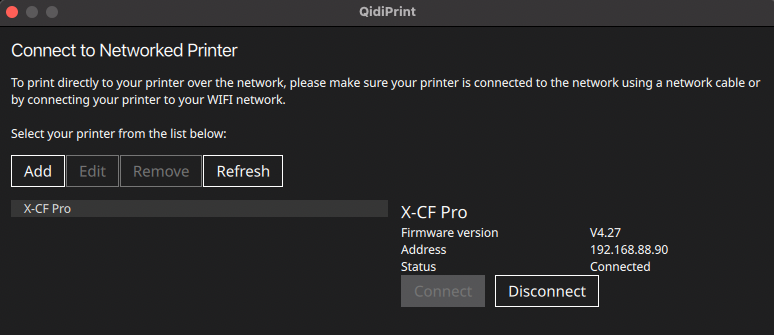

# Ultimaker Cura v5.x QIDI Printer Plugin

## Plugin for Ultimaker Cura v5.x that allows monitoring and printing QIDI 3D printers over network

This plugin is completely based on the great work of [Aleksey Sokolov](https://github.com/alkaes). Original source is [here](https://github.com/alkaes/QidiPrint).

## Print menu button

## Printer Monitor (idle)

## Printer Monitor (printing)

## Installation

With Cura not running, unpack the zip file from the
[release](https://github.com/nkuvyrkin/Ultimaker-Cura-v5.x-QIDI-Printer-Plugin/releases/latest) to this specific folder:

  * Windows: `%USERPROFILE%\AppData\Roaming\cura\5.2.1\`
  * MacOS: `~/Library/Application Support/Cura/5.2.1/`
  * Linux: `/home/<username>/.local/share/cura/5.2.1/`

If you have the other Qidi printer model (not X-CF Pro), unpack the [Qidi Printer Definitions.zip](https://github.com/alkaes/Qidi-Printer-Definitions/releases/download/1.0/Qidi-Printer-Definitions.v1.0.zip) to this specific folder:
  * Windows: `%USERPROFILE%\AppData\Roaming\cura\5.2.1\`
  * MacOS: `~/Library/Application Support/Cura/5.2.1/`
  * Linux: `/home/<username>/.local/share/cura/5.2.1/`

The plugin compatibility with the other QIDI printers is not tested, but hopefully it will work.

## Configuration

**Do NOT try to add a new "networked printer"!** This is only for Ultimaker printers.

**If you did not use printer definitions archive from above to add Qidi printer, in order for this plugin working properly, your printer.def.json must have "manufacturer" property set to "Qidi"**

QIDI printers are configured through the extension menu bar:

* Start Cura
* Inside the cura Prefernces->Printers selct and activate your printer
* Click "QidiPrint" button right to the Machine Settings button:

* A new window will pop-up with detected printers list (you also can add them manually by pressing the Add button)

* Choose your printer and press the "Connect" button
* Click "Close"
* Done!

Now you can load a model and slice it. Then look at the bottom right - there
should be the big blue button with you printer name on it!
